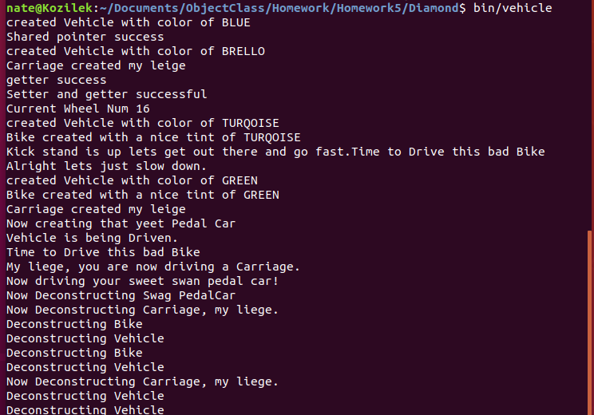

# Diamond of Death
>This is the Diamond of Death which is a common problem that can happen when creating multiple inheritance. C++ has a very simple solution to this problem which is shown here. The Problem follows the simple hierarchy so i only added one object that would use the original Carriage and Bike, called pedal car, I used virtual objects to ensure no copies were made so that i could create the diamond with no issue.

