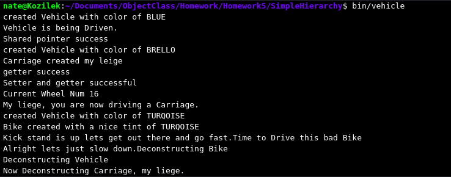

# Simple Hierarchy
## Multiple Inheritance
> Hierarchy is the basis of understanding when it comes to object oriented design, so for my basic example i used the old bike and carriage to relate to the parent class Vehicle. This was a really interesting development but i can confirm it does work. All i need now is some real methods to use this for.

